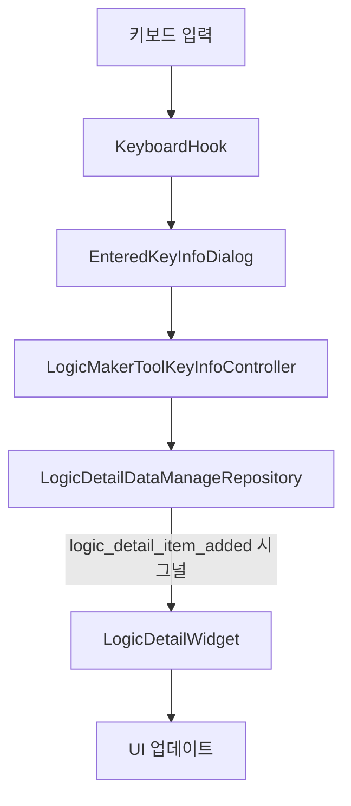

# 키 입력 프로세스 흐름

## 1. 키 입력 모달 표시
### 파일
- `logic_maker_tool_widget.py`

### 메서드
- `_open_key_input_dialog()`

### 동작
1. `EnteredKeyInfoDialog` 인스턴스 생성
2. 모달 다이얼로그로 표시

## 2. 키 입력 감지 및 처리
### 파일
- `entered_key_info_dialog.py`
- `keyboard_hook.py`

### 메서드
- `keyboard_hook.py`:
  - `start()`: 키보드 후킹 시작
  - `_hook_callback()`: 키 이벤트 감지
  - `get_last_key_info()`: 마지막 입력된 키 정보 반환

### 데이터
- 키 입력 정보 구조:
```python
{
    'key_code': str,          # 키 코드
    'scan_code': int,         # 스캔 코드
    'virtual_key': int,       # 가상 키 코드
    'modifiers_key_flag': list,        # 수정자 키 목록
    'simple_display_text': str # 간단한 표시 텍스트
}
```

### 동작
1. 키보드 후킹 시작
2. 키 이벤트 감지
3. 키 정보 포맷팅
4. UI 업데이트

## 3. 키 정보 확인 및 저장
### 파일
- `entered_key_info_dialog.py`

### 메서드
- `get_result()`: 확인된 키 정보 반환
- `accept()`: 다이얼로그 승인

### 데이터
- 포맷된 키 정보가 반환됨

### 동작
1. 사용자가 확인 버튼 클릭
2. 현재 키 정보 검증
3. 다이얼로그 승인

## 4. 키 정보 컨트롤러 처리
### 파일
- `logic_maker_tool_key_info_controller.py`

### 메서드
- `key_state_info_process(entered_key_info)`

### 데이터 변환
입력:
```python
{
    'key_code': str,
    'scan_code': int,
    'virtual_key': int,
    'modifiers_key_flag': list,
    'simple_display_text': str
}
```

출력 (두 개의 아이템 생성):
```python
# 키 누르기 상태
{
    'type': 'key',
    'key': str,
    'modifiers_key_flag': list,
    'logic_detail_item_dp_text': str,
    'action': '누르기',
    'scan_code': int,
    'virtual_key': int
}

# 키 떼기 상태
{
    'type': 'key',
    'key': str,
    'modifiers_key_flag': list,
    'logic_detail_item_dp_text': str,
    'action': '떼기',
    'scan_code': int,
    'virtual_key': int
}
```

### 동작
1. 키 정보 검증
2. 누르기/떼기 상태 정보 생성
3. 각 상태 정보 검증
4. Repository로 전달

## 5. Repository 처리
### 파일
- `logic_detail_data_manage_repository.py`

### 메서드
- `add_item(item_info)`

### 데이터
- 입력된 아이템 정보에 order 추가:
```python
{
    'type': 'key',
    'key': str,
    'modifiers_key_flag': list,
    'logic_detail_item_dp_text': str,
    'action': str,
    'scan_code': int,
    'virtual_key': int,
    'order': int  # 자동 할당
}
```

### 동작
1. 아이템 정보 검증
2. order 값 할당
3. 아이템 목록에 추가
4. 로그 기록
5. logic_detail_item_added 시그널 발생

## 6. UI 업데이트
### 파일
- `logic_detail_widget.py`

### 메서드
- `_update_list_widget()`

### 데이터
- Repository의 아이템 목록

### 동작
1. 리스트 위젯 초기화
2. Repository에서 아이템 목록 조회
3. 각 아이템을 QListWidgetItem으로 변환
4. 리스트 위젯에 표시

## 시그널 흐름
1. 키보드 입력
   - `KeyboardHook._hook_callback()` → `EnteredKeyInfoDialog` (직접 호출)

2. 키 정보 확인
   - `EnteredKeyInfoDialog.accept()` → `LogicMakerToolWidget._open_key_input_dialog()` (다이얼로그 결과)

3. 아이템 추가
   - `LogicDetailDataManageRepository.add_item()` → `logic_detail_item_added` 시그널 → `LogicDetailWidget._update_list_widget()`

## 데이터 흐름
